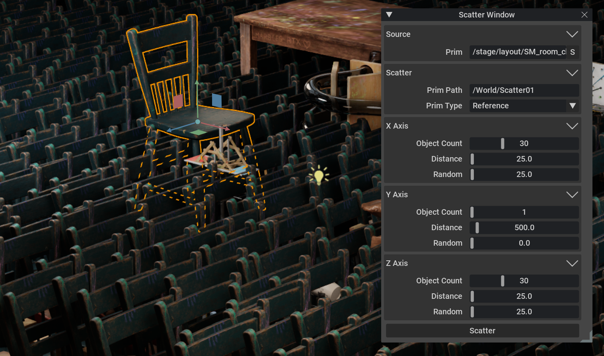

## A simple scatter tool

## Adding the extension

To add a those extensions to your Omniverse app:
1. Go into: Extension Manager -> Gear Icon -> Extension Search Path
2. Add this as a search path: `git://github.com/NVIDIA-Omniverse/kit-extension-sample-scatter?branch=main&dir=exts`

## Contributing
The source code for this repository is provided as-is and we are not accepting outside contributions.
