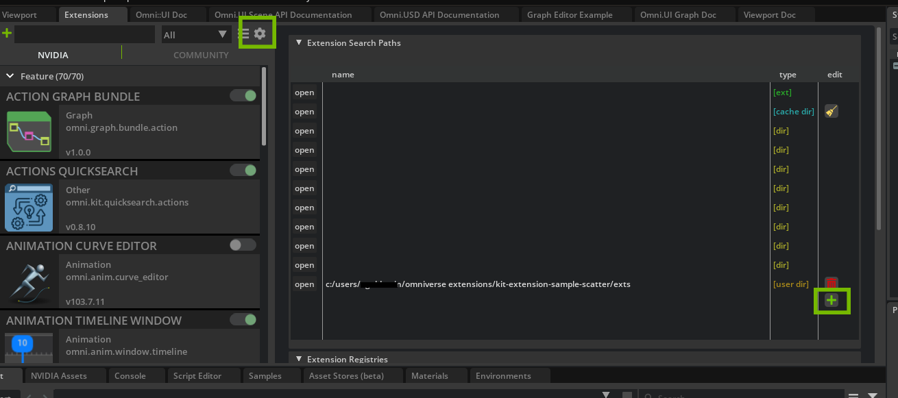
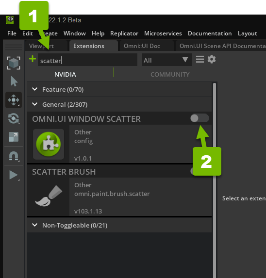
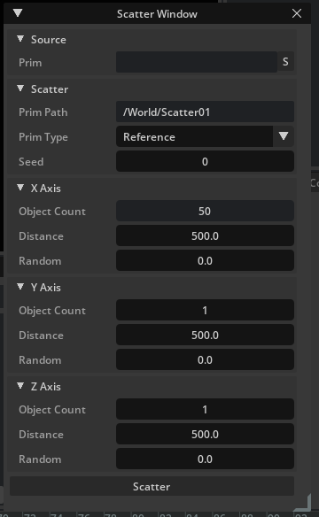

# How to Create a Scatter Tool 

In this guide, we will be providing you with the steps you need to create a scatter tool that can randomize prims around the world space. You will create a tool that can scatter on X, Y, and Z axes by the amount of objects, their distance, and their random count. This guide is well suited for intermediate engineers. 

# Learning Objects

- How to use Omniverse UI Framework
- Add Extension from Local Path
- Set Scatter Properties
- Analyze Random Number Generator
- Apply USD API to set up PointInstancer
- When to use `undo` function

# Prerequisites

It is recomemended to understand the concepts in this guide that you have completed the folllowing:

-  Installed Omniverse Code version 2022.1.2 
- [Extension Environment Tutorial](https://github.com/NVIDIA-Omniverse/ExtensionEnvironmentTutorial)
- [Spawn Prims Extension Tutorial](https://github.com/NVIDIA-Omniverse/kit-extension-sample-spawn-prims)


## Step 1: Install the Starter Project Extension

In this section you download the project and install the extension.

### Step 1.1: Download The Scatter Project

 Clone the `tutorial-start` branch of `kit-extension-sample-scatter` [github repository](https://github.com/NVIDIA-Omniverse/kit-extension-sample-scatter/tree/tutorial-start):

```bash
git clone -b tutorial-start https://github.com/NVIDIA-Omniverse/kit-extension-sample-scatter.git
```

This repository contains the assets in this tutorial 


### Step 1.2 Open the Extensions Tab


In Omniverse Code, click the _Extensions_ tab:


If it's not there, make sure it's checked in **Window > Extensions**.


### Step 1.3: Add Extension From Local Path

In the *Extensions* tab, click the **gear icon** to open *Extension Search Path*. Then, click the **green plus** icon to add a new path. Finally, copy and paste the local path of the `exts` folder from the  `tutorial-start` branch: 



Here, you imported the extension into the `Extension Manager` in `Omniverse Code` by adding the local path of the `tutorial-start` branch you cloned from the [github repository](https://github.com/NVIDIA-Omniverse/kit-extension-sample-scatter/tree/tutorial-start).

### Step 1.4: Verify the Extension is Active 

If you don't see `Scatter Window` pop up after adding the local path, ensure the extension in enabled in the `Extensions Manager`.

Type "scatter" into the search box at the top of the Extensions. Then, if the `slider` is in the left (off) position click it to activate the extension.




## Step 2: Build the UI   

This guide starts with a blank `Scatter Window`. In the following steps, you will learn to use `Omniverse UI Framework` to build the UI for **Source**, **Scatter**, and each **Axis**. 

This step will focus on the `window.py` file found in the `exts/omni.example.ui_scatter_tool/omni/example/ui_scatter_tool/` directory. To learn more about the other files in the respository, refer to [How to Make an Extension by Spawning Primitives](https://github.com/NVIDIA-Omniverse/kit-extension-sample-spawn-prims/blob/main/exts/omni.example.spawn_prims/tutorial/tutorial.md).


By the end of Step 2, your `Scatter Window` UI will be built out.

### Step 2.1: Build Source Function

To begin the scatter tool UI, you will start by picking the source of the prim to be scattered. 

For this step, look at the `_build_source` function. Currently, it should look like this:

```python
def _build_source(self):
    """Build the widgets of the "Source" group"""
    pass
```

The objective of this function is create a place to display the source path of the prim.  

Set this up by using the `Omniverse UI Framework` ([click here for more information](https://docs.omniverse.nvidia.com/py/kit/source/extensions/omni.ui/docs/index.html)) to create a `Collapsable Frame`. 

```python
    def _build_source(self):
        """Build the widgets of the "Source" group"""
        # Create frame
        with ui.CollapsableFrame("Source", name="group"):
```

Then, use a `VStack` to create the column and an `HStack` to create a row.

```python
    def _build_source(self):
        """Build the widgets of the "Source" group"""
        # Create frame
        with ui.CollapsableFrame("Source", name="group"):
            # Create column
            with ui.VStack(height=0, spacing=SPACING):
                # Create row
                with ui.HStack():
```

Next, create a `Label` to name the field.

```python
    def _build_source(self):
        """Build the widgets of the "Source" group"""
        # Create frame
        with ui.CollapsableFrame("Source", name="group"):
            # Create column
            with ui.VStack(height=0, spacing=SPACING):
                # Create row
                with ui.HStack():
                  # Give name of field
                    ui.Label("Prim", name="attribute_name", width=self.label_width)
                    ui.StringField(model=self._source_prim_model)
```

Finally, add a button that will take the user's current selection and populate the string field.

```python
    def _build_source(self):
        """Build the widgets of the "Source" group"""
        # Create frame
        with ui.CollapsableFrame("Source", name="group"):
            with ui.VStack(height=0, spacing=SPACING):
                with ui.HStack():
                  # Give name of field
                    ui.Label("Prim", name="attribute_name", width=self.label_width)
                    ui.StringField(model=self._source_prim_model)
                    # Button that puts the selection to the string field
                    ui.Button(
                        " S ",
                        width=0,
                        height=0,
                        style={"margin": 0},
                        clicked_fn=self._on_get_selection,
                        tooltip="Get From Selection",
                    )
```

Don't worry if you do not see your changes in the `Scatter Window`, the UI will be fully constructed at the end of Step 2 in `build_fn`.

### Step 2.2: Build the Scatter Function:
In this step you will use the `Omniverse UI Framework` to create the `Prim Path` and `Prim Type`. 

Move further down `window.py` to `_build_scatter` function, which currently looks like this:

  ```python
    def _build_scatter(self):
        """Build the widgets of the "Scatter" group"""
        pass
  ```

Just as you did in the previous step, create the UI using `CollapsableFrame`:

  ```python
    def _build_scatter(self):
        """Build the widgets of the "Scatter" group"""
        with ui.CollapsableFrame("Scatter", name="group"):
  ```

  Then, create one column that will nest 3 rows. Within these rows you will create a `Label`, one for `Prim Path`, `Path Type`, and `Seed`.

  ```python
    def _build_scatter(self):
        """Build the widgets of the "Scatter" group"""
        with ui.CollapsableFrame("Scatter", name="group"):
            # Column
            with ui.VStack(height=0, spacing=SPACING):
                # Row
                with ui.HStack():
                    ui.Label("Prim Path", name="attribute_name", width=self.label_width)
                    ui.StringField(model=self._scatter_prim_model)

                # Row
                with ui.HStack():
                    ui.Label("Prim Type", name="attribute_name", width=self.label_width)
                    ui.ComboBox(self._scatter_type_model)

                # Row
                with ui.HStack():
                    ui.Label("Seed", name="attribute_name", width=self.label_width)
                    ui.IntDrag(model=self._scatter_seed_model, min=0, max=10000)
  ```
  
  ### Step 2.3: Build Axis Function
 
The final function for the `Scatter Window` will build the UI needed to set the parameters of scatter on the X, Y, and Z axes.

Take a look at the `_build_axis()` definition, which looks like this currently:

  ```python
    def _build_axis(self, axis_id, axis_name):
        """Build the widgets of the "X" or "Y" or "Z" group"""
        pass
  ```

 The `UI Framework` will be used for this function as well, following the same structure as `_build_scatter()` with a Collapsable Frame, one column, and 3 rows. Each row will have a `Label` for Object Count, Distance, and Random.
 
You only need this one function since it will be reused for each axis later on.

  ```python
    def _build_axis(self, axis_id, axis_name):
        """Build the widgets of the "X" or "Y" or "Z" group"""
        with ui.CollapsableFrame(axis_name, name="group"):
            # Column
            with ui.VStack(height=0, spacing=SPACING):
                # Row
                with ui.HStack():
                    ui.Label("Object Count", name="attribute_name", width=self.label_width)
                    ui.IntDrag(model=self._scatter_count_models[axis_id], min=1, max=100)

                # Row
                with ui.HStack():
                    ui.Label("Distance", name="attribute_name", width=self.label_width)
                    ui.FloatDrag(self._scatter_distance_models[axis_id], min=0, max=10000)

                # Row
                with ui.HStack():
                    ui.Label("Random", name="attribute_name", width=self.label_width)
                    ui.FloatDrag(self._scatter_random_models[axis_id], min=0, max=10000)

  ```

### Step 2.4: Build Function
 

Now that you have the `UI Framework` for `Scatter Window`, you will use the `_build_fn` to call the functions to construct the UI elements for **source**, **scatter**, and our **X**, **Y**, and **Z** axes.

Currently, `_build_fn()` looks like this:

```python
    def _build_fn(self):
        """
        The method that is called to build all the UI once the window is
        visible.
        """
        pass
```

A `ScrollingFrame` will contain each function and nest it in one column. 

Notice that `_build_axis` is called three times with arguments to identify which axis it will represent. 

After the frame is built, add a `GO` button that will start the scatter. 

```python
    def _build_fn(self):
        """
        The method that is called to build all the UI once the window is
        visible.
        """
        # Frame
        with ui.ScrollingFrame():
            # Column
            with ui.VStack(height=0):
                # Build it
                self._build_source()
                self._build_scatter()
                self._build_axis(0, "X Axis")
                self._build_axis(1, "Y Axis")
                self._build_axis(2, "Z Axis")

                # The Go button
                ui.Button("Scatter", clicked_fn=self._on_scatter)
```

## Congratulations!

You have created the UI Framework for `Scatter Window`!




## Step 3: On Scatter Function 

In this step, you will add to the function that is called when the `Scatter` button is pressed. 

Locate the `_on_scatter` function at line 73 of `window.py`, it will look like this:

```python
    def _on_scatter(self):
        """Called when the user presses the "Scatter" button"""
        prim_names = [i.strip() for i in self._source_prim_model.as_string.split(",")]
        if not prim_names:
            prim_names = get_selection()

        if not prim_names:
            pass
```

The variable `prim_names` is already defined so now you need to get the scatter properties from the models and pass them to `duplicate_prims()` which will do the work to scatter the prims. For this guide we have provided you with some arrays and loops for the properties but you are encouraged to experiment with your own as well.

```python
    def _on_scatter(self):
        """Called when the user presses the "Scatter" button"""
        prim_names = [i.strip() for i in self._source_prim_model.as_string.split(",")]
        if not prim_names:
            prim_names = get_selection()

        if not prim_names:
            pass

        transforms = scatter(
            count=[m.as_int for m in self._scatter_count_models],
            distance=[m.as_float for m in self._scatter_distance_models],
            randomization=[m.as_float for m in self._scatter_random_models],
            id_count=len(prim_names),
            seed=self._scatter_seed_model.as_int,
        )

        duplicate_prims(
            transforms=transforms,
            prim_names=prim_names,
            target_path=self._scatter_prim_model.as_string,
            mode=self._scatter_type_model.get_current_item().as_string,
        )
```

## Congratulations!

Now, after you have created a prim in the `Viewport`, set it in `Source`, and click `Scatter`. Your prim will scatter using the properties set above.


## Step 4: (Optional) scatter.py

> **_NOTE:_** This is a review and no code is being added
 

This section will introduce `scatter.py` and briefly showcase its function in the scatter tool.

Begin by navigating to `scatter.py` in your `exts` folder hierarchy. 

This script is where the `on_scatter` function in `window.py` is pulling its information from. Notice the following arguments in `scatter.py`:

```python
def scatter(
    count: List[int], distance: List[float], randomization: List[float], id_count: int = 1, seed: Optional[int] = None
):
...
```

These arguments match up with the properties in `transforms` from the previous step of `on_scatter`.

The docstring below provides a description for each parameter:

```python
    """
    Returns generator with pairs containing transform matrices and ids to
    arrange multiple objects.

    ### Arguments:

        `count: List[int]`
            Number of matrices to generage per axis

        `distance: List[float]`
            The distance between objects per axis

        `randomization: List[float]`
            Random distance per axis

        `id_count: int`
            Count of differrent id

        `seed: int`
            If seed is omitted or None, the current system time is used. If seed
            is an int, it is used directly.
""""
```

Below this comment is where the loop is initialized to randomly generated a sets of points as well as create a matrix with position randomization for each axis:

```python
    # Initialize the random number generator.
    random.seed(seed)

    for i in range(count[0]):
        x = (i - 0.5 * (count[0] - 1)) * distance[0]

        for j in range(count[1]):
            y = (j - 0.5 * (count[1] - 1)) * distance[1]

            for k in range(count[2]):
                z = (k - 0.5 * (count[2] - 1)) * distance[2]

                # Create a matrix with position randomization
                result = Gf.Matrix4d(1)
                result.SetTranslate(
                    Gf.Vec3d(
                        x + random.random() * randomization[0],
                        y + random.random() * randomization[1],
                        z + random.random() * randomization[2],
                    )
                )

                id = int(random.random() * id_count)

                yield (result, id)
```

`scatter.py` is where you can adjust to create different types of scatters, such as scatter on the geometry or a scatter that uses texture.

## Step 5: (Optional) command.py

> **_NOTE:_** This is a review and no code is being added.

This section will introduce `command.py` and briefly review its importance to the scatter tool.

Navigate to `command.py` in the `exts` folder and review what's inside. 

At the start of the `ScatterCreatePointInstancerCommand` class, the docstring provides descriptions for each of the parameters.

```python
    """
    Create PointInstancer undoable **Command**.

    ### Arguments:

        `path_to: str`
            The path for the new prims
            
        `transforms: List`
            Pairs containing transform matrices and ids to apply to new objects

        `prim_names: List[str]`
            Prims to duplicate
    """
```

Below the comment is where these arguments are initialized, sets the USD stage, and unzips the list of tuples:

```python
    def __init__(
        self,
        path_to: str,
        transforms: List[Tuple[Gf.Matrix4d, int]],
        prim_names: List[str],
        stage: Optional[Usd.Stage] = None,
        context_name: Optional[str] = None,
    ):
        omni.usd.commands.stage_helper.UsdStageHelper.__init__(self, stage, context_name)
        self._path_to = path_to

        # We have it like [(tr, id), (tr, id), ...]
        # It will be transformaed to [[tr, tr, ...], [id, id, ...]]
        unzipped = list(zip(*transforms))

        self._positions = [m.ExtractTranslation() for m in unzipped[0]]
        self._proto_indices = unzipped[1]
        self._prim_names = prim_names.copy()
```

Following that, the `PointInstancer` command is set up. This where the USD API is used to create the geometry and create the points during scatter. 

```python
    def do(self):
        stage = self._get_stage()

        # Set up PointInstancer
        instancer = UsdGeom.PointInstancer.Define(stage, Sdf.Path(self._path_to))
        attr = instancer.CreatePrototypesRel()
        for name in self._prim_names:
            attr.AddTarget(Sdf.Path(name))
        instancer.CreatePositionsAttr().Set(self._positions)
        instancer.CreateProtoIndicesAttr().Set(self._proto_indices)
```

Finally, the `undo()` function is defined. This is called when the user undoes the scatter to restore the prior state of the stage. In this case, the state is restored by simply deleting the PointInstancer. The reason `delete_cmd.do()` is used rather than calling `omni.kit.commands.execute()` is so that the "DeletePrimsCommand" doesn't show up in the Commands History.

```python
    def undo(self):
        delete_cmd = omni.usd.commands.DeletePrimsCommand([self._path_to])
        delete_cmd.do()
```


### This completes the Scatter Tool guide. You now have a working Scatter Tool and understanding of the UI Framework, Scatter Properties, and the modules within the Scatter Tool.